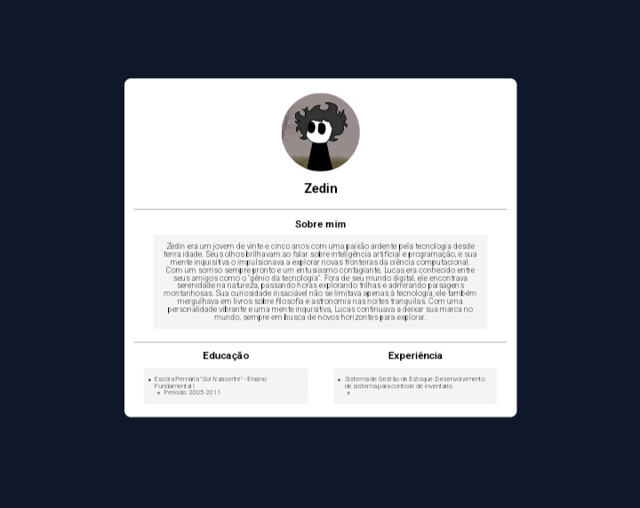

## Crie uma página da web simples que represente o perfil pessoal de um aluno fictício. Esta página deve conter as seguintes seções:

[x] Cabeçalho: Um cabeçalho contendo o nome do aluno e uma foto (pode ser uma imagem fictícia).

[x] Sobre Mim: Uma seção onde o aluno pode escrever algumas informações sobre si mesmo, como hobbies, interesses, etc.

[x] Educação: Uma seção onde o aluno pode listar sua educação atual ou passada, como nome da escola ou faculdade, curso, etc.

[x] Experiência: Uma seção onde o aluno pode listar qualquer experiência de trabalho ou projetos relevantes.

## Requisitos Técnicos:

[x] Use HTML para estruturar a página.

[x] Use CSS para estilizar a página, tornando-a visualmente atraente.

[x] Utilize as tags semânticas do HTML, como `<header>`, `<main>`, `<section>`, `<footer>`, etc., para melhorar a acessibilidade e a estrutura da página.

[x] Experimente com diferentes propriedades CSS para estilizar o layout, fontes, cores, etc.

## Conclusão

